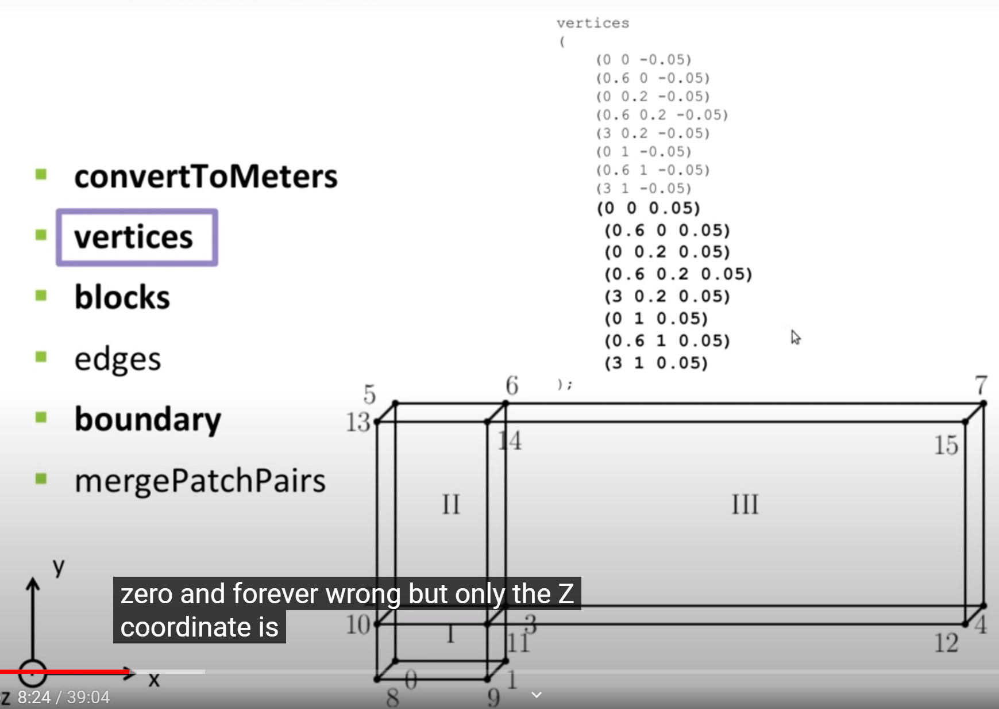
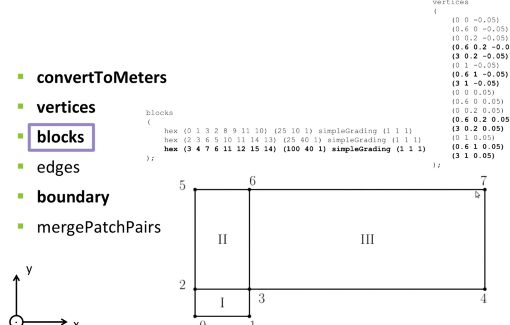
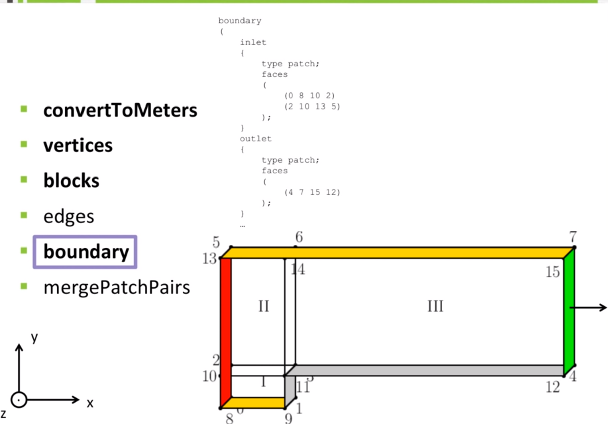
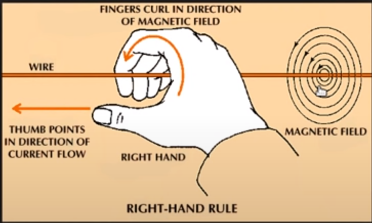

# Chapter 2. How to create a grid with blochMesh in OpenFOAM

## Solver

- SonicFoam:

  > Transient solver for trans-sonic/supersonic, laminar or turbulent flow of a compressible gas

  - compressible
  - transient
  - laminar and turbulent
  - single phase
  - non isothermal

## Mesh File: blockMeshDict

### convertToMeters

### vertices

- vertices coordination of the geometry

### blocks

- (25 10 1) means: mesh number 25 along x axis, 10 along y axis and 1 along yaxis
- simpleGrading (1 1 1): refine grad ratio (the end cell length over the first )
- edgeGrding(1 1 1 1 2 2 2 2 1 1 1 1): refine ratio of each edge

### edges

### boundary

- the boundary face should always point outward the geometry
  

- types
  - patch
  - symmetryPlane
  - empty

### mergePatchPairs

## Understanding blockMeshDict

### coordinates of vertices

### blocks

### refinement

### boundaries

### execution

- blockMesh: commad to generate the mesh files based on the blockMeshDict

## Simulate

- sonicFoam: start simulation

## Postprocessing
