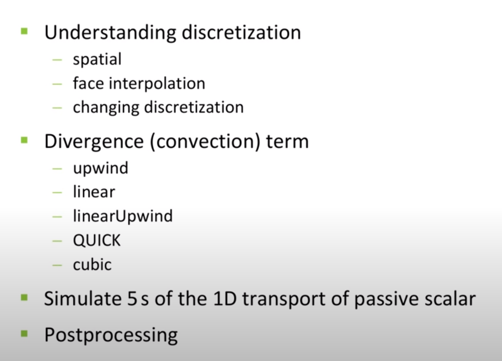
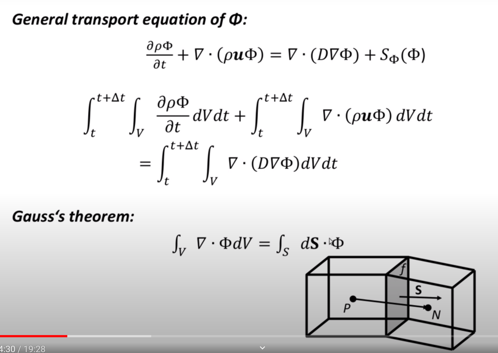
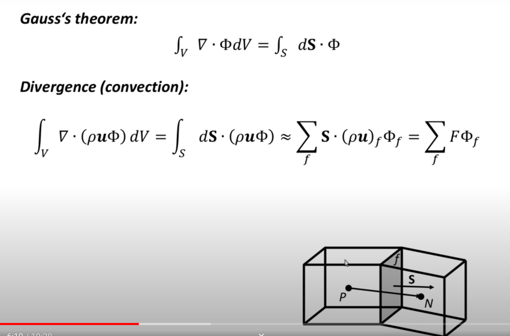
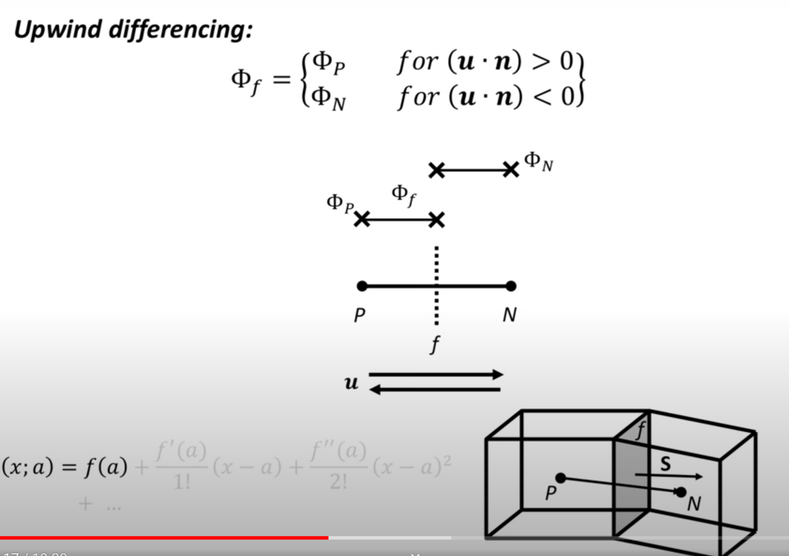
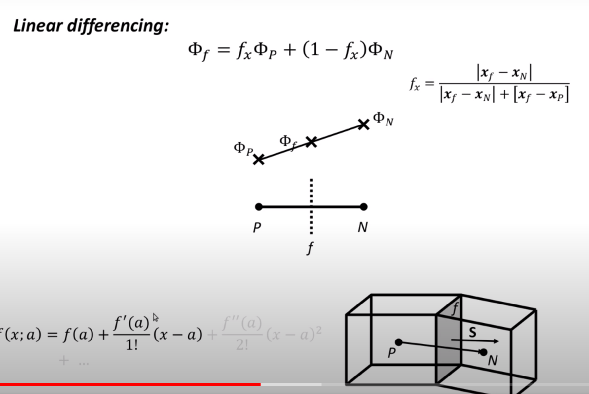
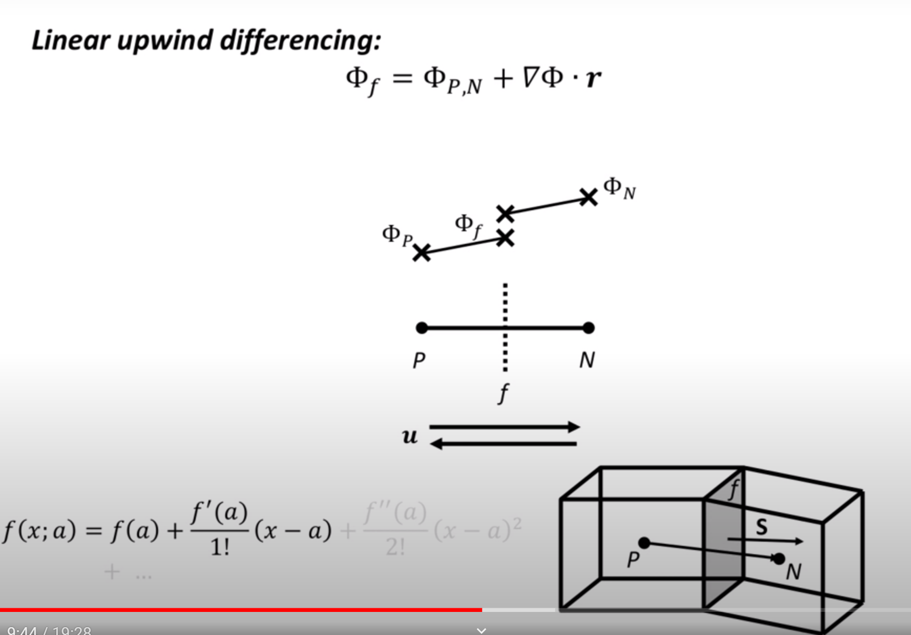

# Introduction to discretization

## Agenda

## Solver: TransportFoam

## Theory:

- same as chapter 4

- Discritation of Finite volume method

- upwind scheme

- linear differencing

- linear upwind differencing

## Notes

- numerical diffusion: upwind
- numerical oscillation: linear,cubic
- numerical instability: quick (may unstable with high velocity)
- numerical accuracy
- computation speed
