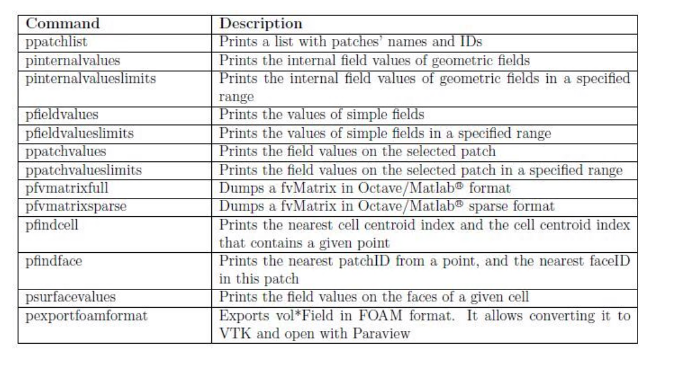
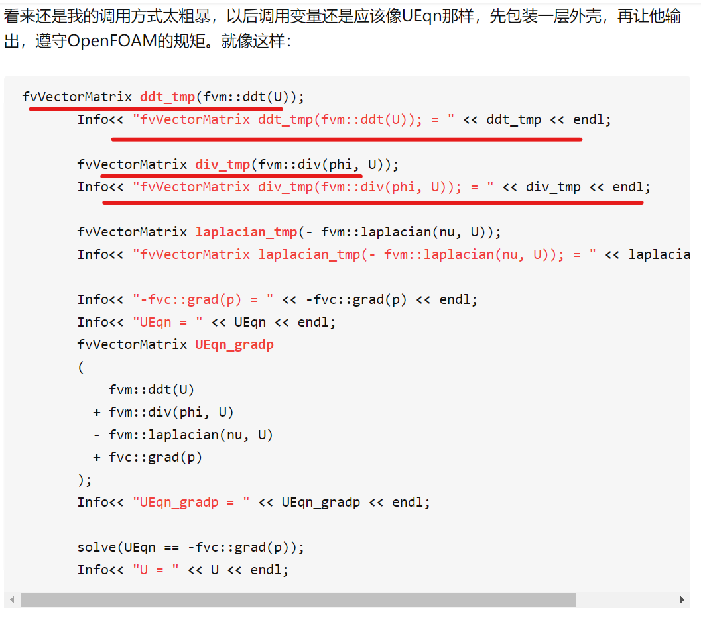
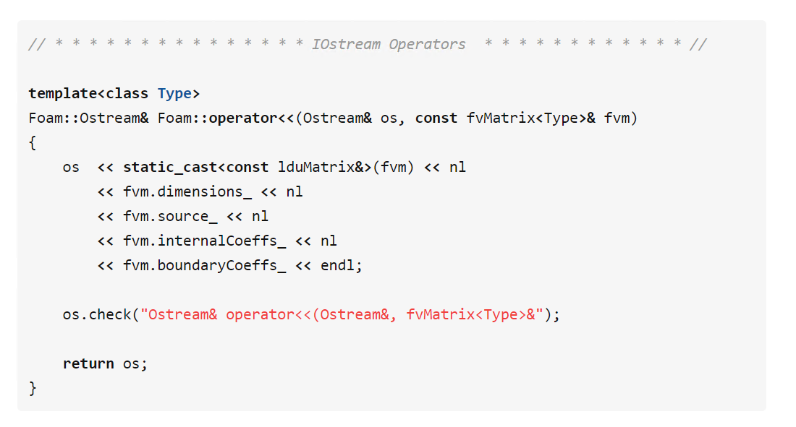
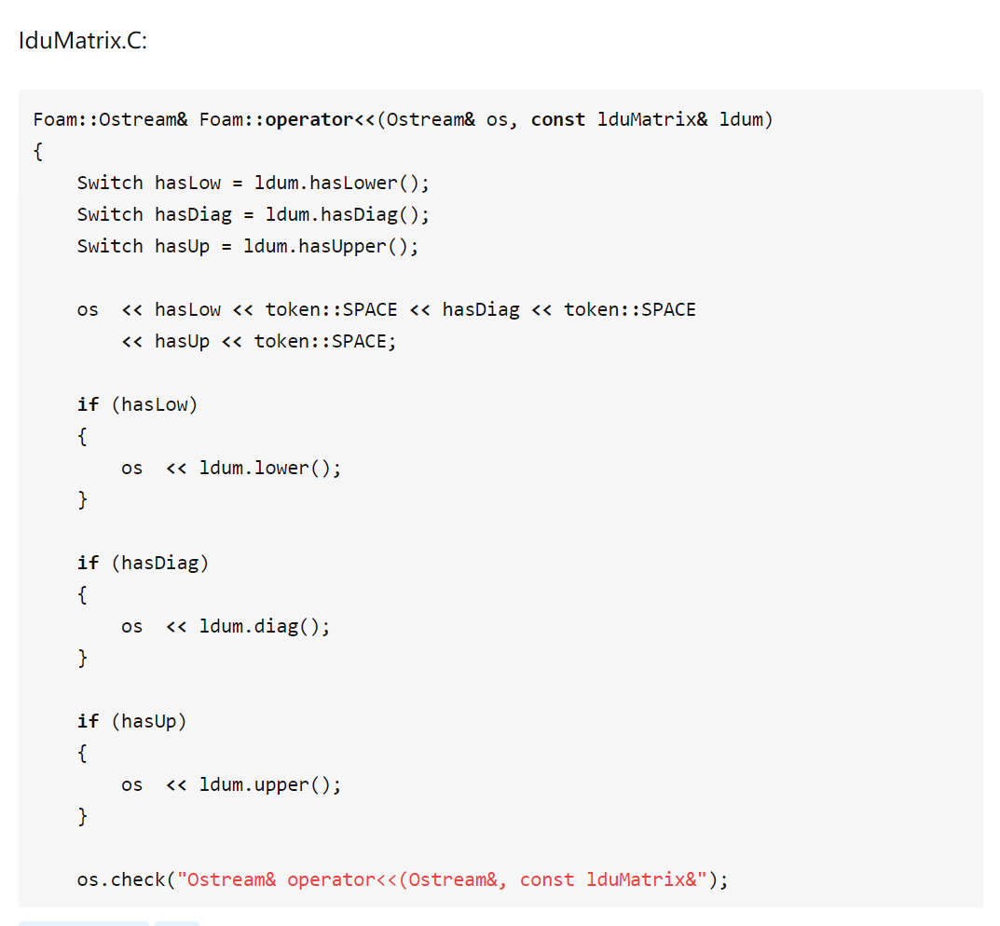

## gdb commands

```
info locals //显示所有局部变量，OpenFOAM里别用，会爆炸
info variables/classes/functions/selectors            //顾名思义，但都别乱用，容易爆炸
info break  //显示所有breakpoints
info source //显示当前位置的文件调用关系，非常有用，尤其是被调用的文件是link的时候
n           //next，单个文件里的下一行
s           //step，下一步，能够跳转进入function内部
finish      //从当前function跳出
return      //取消当前函数的执行，并立即返回，后面可以跟一个数值，作为函数的返回值
c           //continue直到下一个breakpoint
r           //run，开始运行code
b           //设置breakpoint，基本格式：break 49;设定指定文件：b gaussLaplacianScheme.C:52
delete 1    //删除代号为1的断点
clear       //删除所有断点
pfvmatrixfull this matrix.txt    //专门用于输出矩阵，一般要先
ctrl+c      //卡住的时候用来跳出
set logging on/off          //用来将gdb命令显示的结果输出到默认的gdb.txt文件里
where       //告诉你你现在在哪个文件里
l           //list，显示附近的代码。可显示特点行号前后10行代码，如：list 12
watch       //表示设置一个监视点，当所指定的表达式EXPR的值被修改了，则程序会停止。
rwatch      //表示设置一个监视点，当所指定的表达式EXPR的值被读取了，则程序会停止。
awatch      //表示设置一个监视点，当所指定的表达式EXPR的值被读取或修改了，都会让程序停止。
p var       //显示变量var
p var@n     //显示数组变量var的前n个元素
whatis var  //显示变量var的类型
```

## gdbOF



## practices




