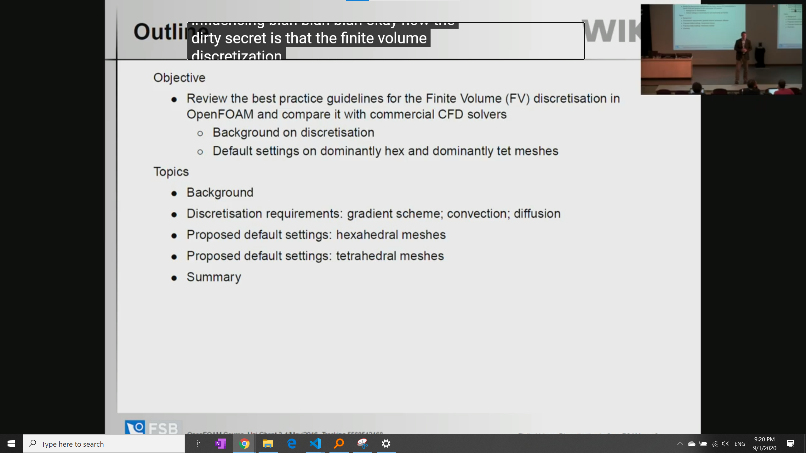
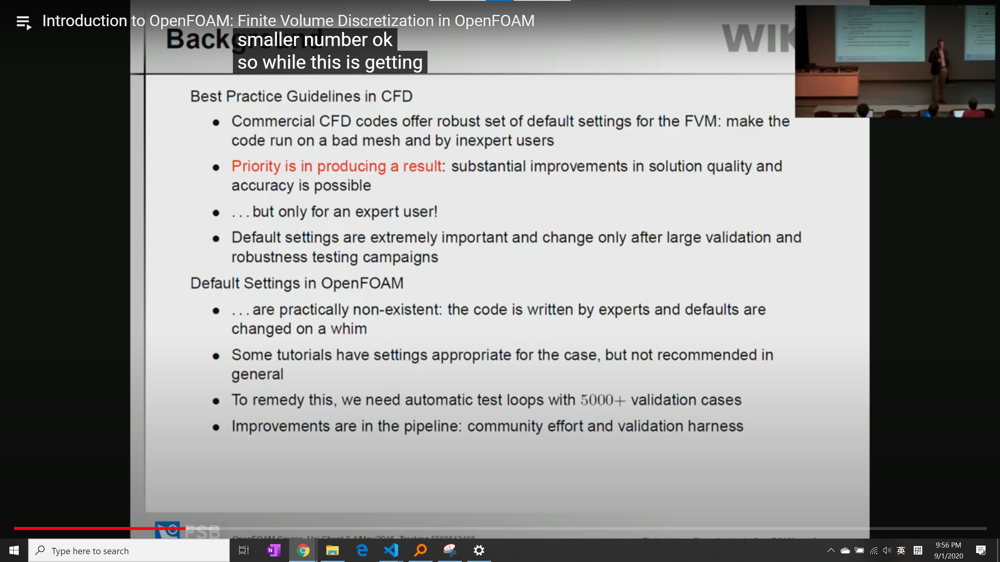
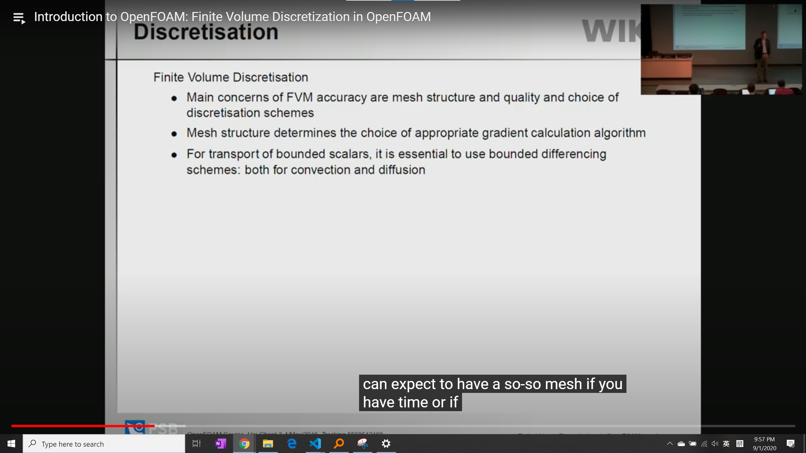
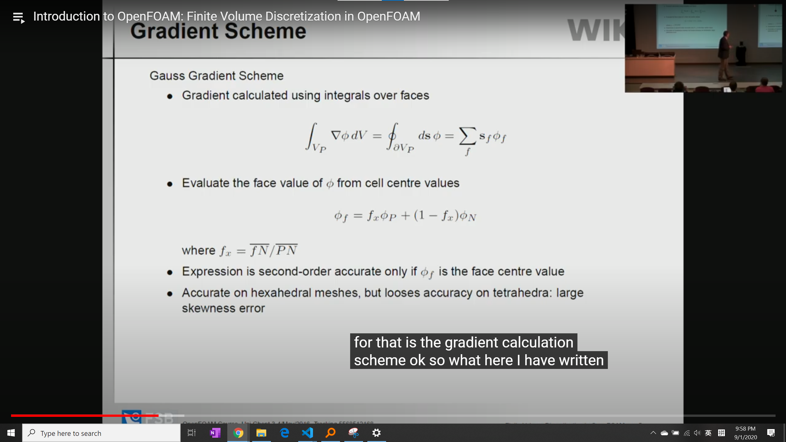
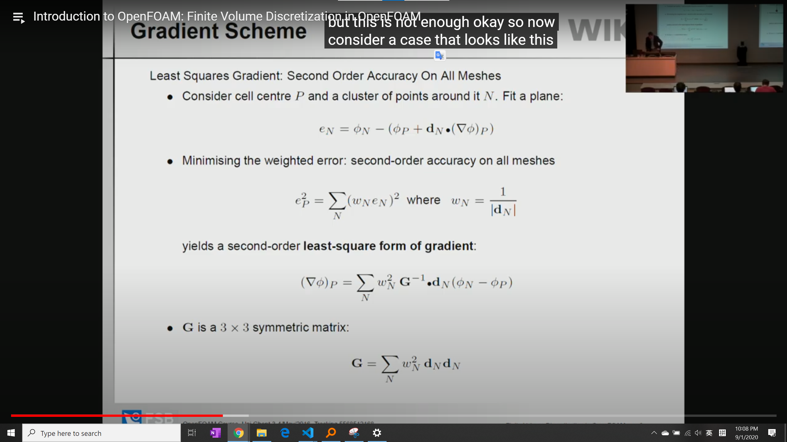
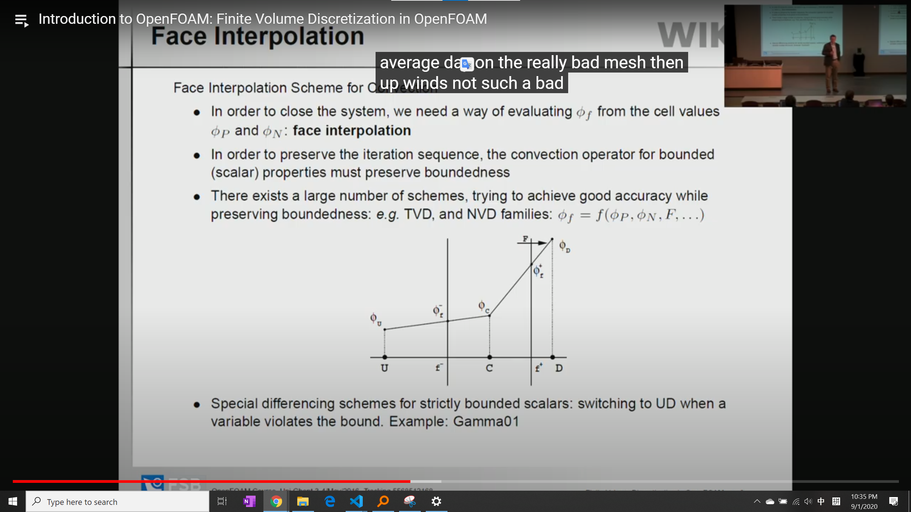
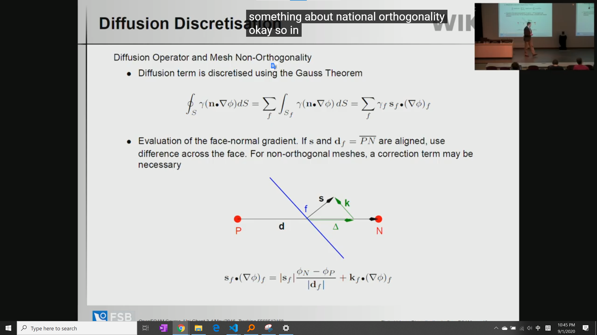
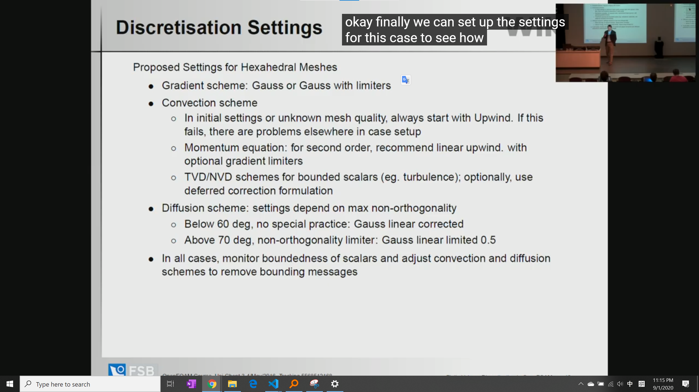
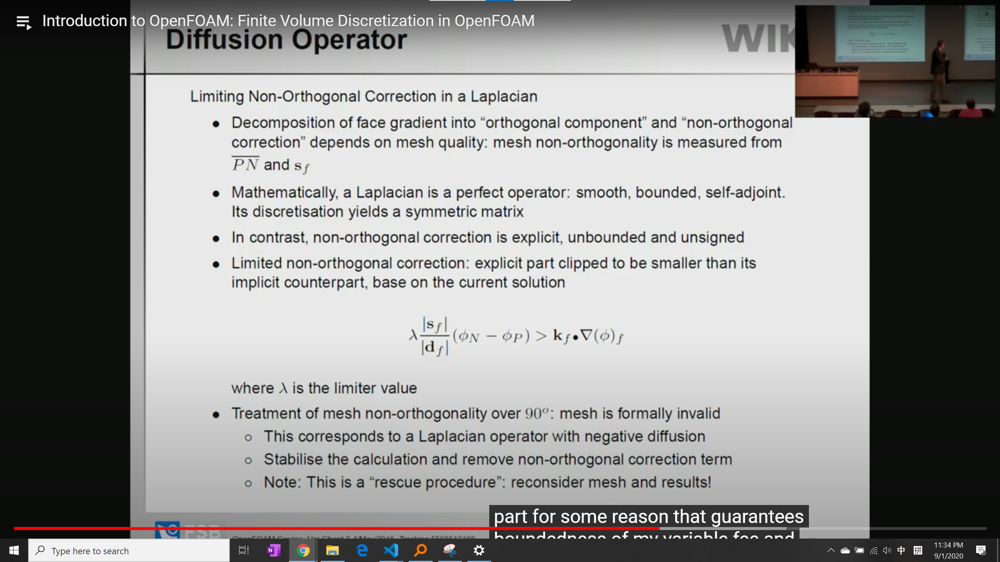
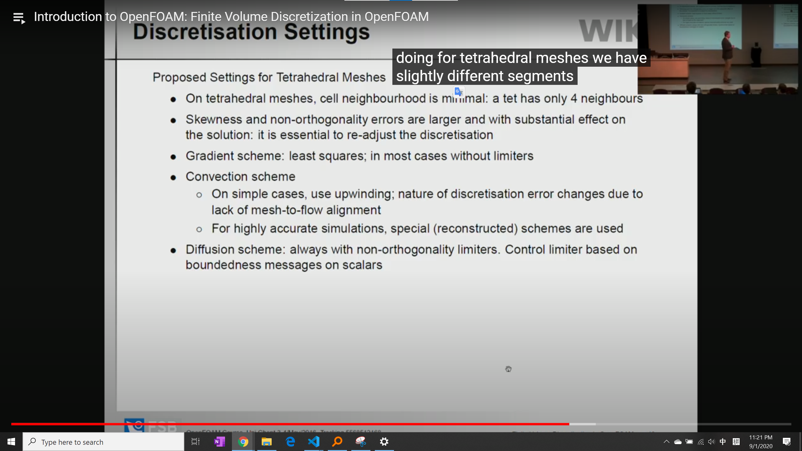

# Introduction to OpenFOAM: Finite Volume Discretization in OpenFOAM

## Agenda

- Hexahedral: 六面体
- tetrahedral： 四面体

## slices

- default gradient scheme for bounded variable, such as concentration: upwind
- default gradient scheme for unbounded variable, such as velocity: linear upwind
- concentration, volume fraction: zero one scheme

