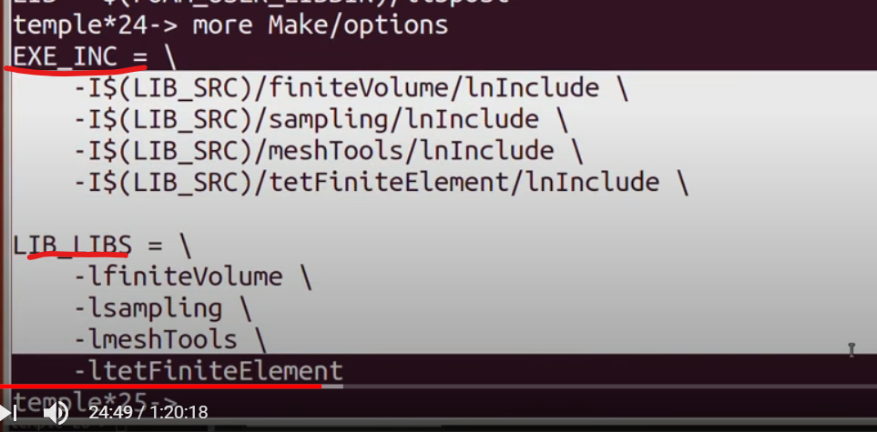

# programming in openFOAM

## slices

### OpenFOAM Work Spaace

- Run directory(\$FOAM_RUN): ready-to0run cases and results, test loop etc. May contain case-specific setup tools, solvers and utilities

### build

- wmake support multiple platform
- only recompile the changes
- make exe: wmake
- make lib: wmake libso

### Creating your applications

- runtime selection table (动态绑定，多态 by interface0
- post-process by function object in controldict
- edit the make file (such as the target dir)

### Programming guidances

- implement new code with class, not function

### Debugging

