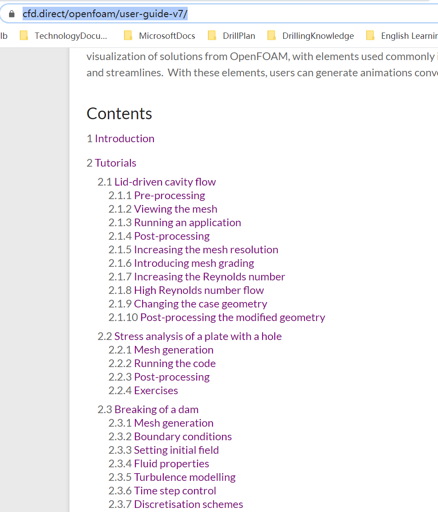

- user guide: https://www.openfoam.com/documentation/user-guide/index.php

- cfd direct user guide v7: https://cfd.direct/openfoam/user-guide-v7/

- user guide v2006: https://www.openfoam.com/documentation/guides/latest/doc/index.html

- c++ source code guide: https://cpp.openfoam.org/v7/index.html
  

- OpenFoam 成长之路：https://openfoam.top/studyMaterials/#blogs

- Algorithm on Solvers and Models in OpenFOAM: https://wenku.baidu.com/view/7b2fc1db8bd63186bdebbc0c

- Proceedings of CFD with OpenSource Software, 2019, Edited by Nilsson H: http://www.tfd.chalmers.se/~hani/kurser/OS_CFD/#YEAR_2019
