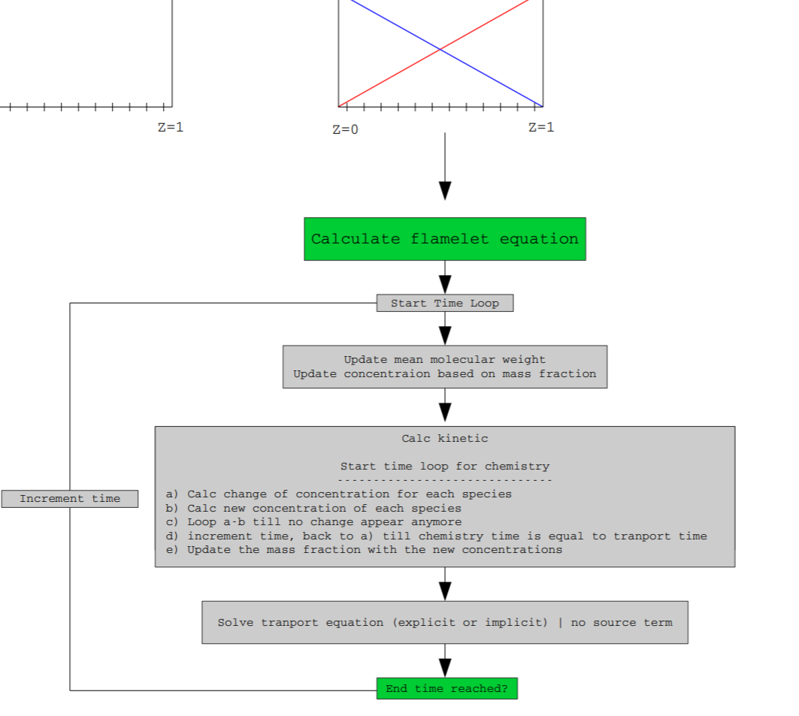
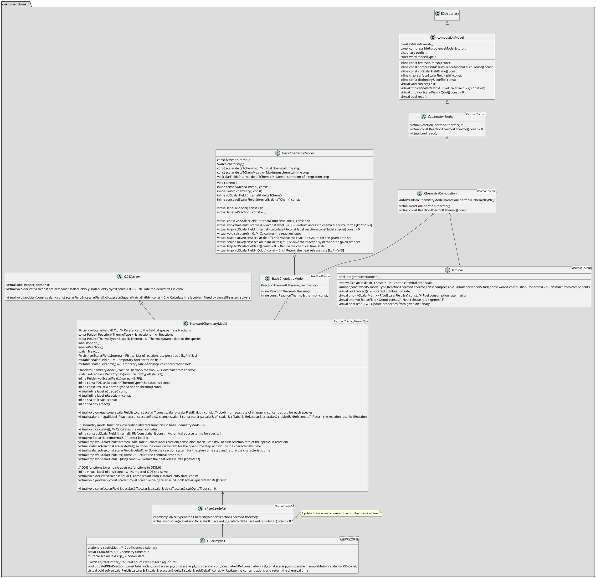

## Time splitting

1. First I solve the reaction term dY/dt = f(Y) only with the ODE solver in OpenFOAM from t0 to t0+Dt with Dt being the time step size of the transport equation. Y0 and YEnd is the initial and final results at t0 and t0+Dt in this ODE. The reaction-> correct() actually solves the stiff chemical ode to get R[i](order of integration is 10e-9 integrated upto ~ deltaT)

The ODE time step size (dt) that is automatically determined by the ODE solver of OpenFOAM so that sufficiently small to meet the error tolerance.

2. Second I construct the source term as dYdt = (YEnd-Y0)/Dt.

3. Third shuffle the dYdt as an explicit source term to the transport equation and solve the transport equation. the species equation is solved based normal implicit scheme

More discussions see (here)[https://www.cfd-online.com/Forums/main/177140-numerical-treatment-source-term-combustion-equations-2.html]

The workflow see the followings


## ChemistryReaders

Reactions are read by ChemistryReaders, which is the base class of the reactingMixture.

```cpp
template<class ThermoType>
Foam::reactingMixture<ThermoType>::reactingMixture
(
    const dictionary& thermoDict,
    const fvMesh& mesh,
    const word& phaseName
)
:
    speciesTable(),
    autoPtr<chemistryReader<ThermoType>>
    (
        chemistryReader<ThermoType>::New(thermoDict, *this) //RTS
    ),
    multiComponentMixture<ThermoType>
    (
        thermoDict,
        *this,
        autoPtr<chemistryReader<ThermoType>>::operator()().speciesThermo(),
        mesh,
        phaseName
    ),
    PtrList<Reaction<ThermoType>>
    (
        autoPtr<chemistryReader<ThermoType>>::operator()().reactions()
    ),
    speciesComposition_
    (
        autoPtr<chemistryReader<ThermoType>>::operator()().specieComposition()
    )
{
    autoPtr<chemistryReader<ThermoType>>::clear();
}
```

Take foamChemistryReader as example. The reader constructor read the foamChemistryFile value to get the chemDict*, and read foamChemistryThermoFile value to get the thermoDict*. Then it read the species thermo and a list of reactions defined in thermoDict* and chemDict*

```cpp
template<class ThermoType>
Foam::foamChemistryReader<ThermoType>::foamChemistryReader
(
    const dictionary& thermoDict,
    speciesTable& species
)
:
    chemistryReader<ThermoType>(),
    chemDict_
    (
        IFstream
        (
            fileName(thermoDict.lookup("foamChemistryFile")).expand()
        )()
    ),
    thermoDict_
    (
        IFstream
        (
            fileName(thermoDict.lookup("foamChemistryThermoFile")).expand()
        )()
    ),
    speciesTable_(setSpecies(chemDict_, species)),
    speciesThermo_(thermoDict_), // HashPtrTable<ThermoType> ,Table of the thermodynamic data given in the foamChemistry file
    reactions_(speciesTable_, speciesThermo_, chemDict_) //ReactionList<ThermoType>,- List of the reactions
{
    readSpeciesComposition();
}

```

ReactionList constructor. It assigned the species table and speciesThermo to the field variables. It then read reaction from the chemDict\_

```cpp
template<class ThermoType>
Foam::ReactionList<ThermoType>::ReactionList
(
    const speciesTable& species,
    const HashPtrTable<ThermoType>& thermoDb,
    const dictionary& dict
)
:
    SLPtrList<Reaction<ThermoType>>(),
    species_(species),
    thermoDb_(thermoDb),
    dict_(dict)
{
    readReactionDict();
}

```

During readReactionDict, it will loop all the reactions subDict to compose the reaction object by RTS

```cpp

template<class ThermoType>
bool Foam::ReactionList<ThermoType>::readReactionDict()
{
    const dictionary& reactions(dict_.subDict("reactions"));

    // Set general temperature limits from the dictionary
    Reaction<ThermoType>::TlowDefault =
        dict_.lookupOrDefault<scalar>("Tlow", 0);

    Reaction<ThermoType>::ThighDefault =
        dict_.lookupOrDefault<scalar>("Thigh", great);

    forAllConstIter(dictionary, reactions, iter)
    {
        const word reactionName = iter().keyword();

        this->append
        (
            Reaction<ThermoType>::New
            (
                species_,
                thermoDb_,
                reactions.subDict(reactionName)
            ).ptr()
        );
    }

    return true;
}
```

Take irreversibleArrheniusReaction as example

```OPENFOAM
    methaneReaction
    {
        type     irreversibleArrheniusReaction;
        reaction "CH4 + 2O2 = CO2 + 2H2O";
        A        5.2e16;
        beta     0;
        Ta       14906;
    }
```

```cpp

template
<
    template<class> class ReactionType,
    class ReactionThermo,
    class ReactionRate
>
Foam::IrreversibleReaction<ReactionType, ReactionThermo, ReactionRate>::
IrreversibleReaction
(
    const speciesTable& species,
    const HashPtrTable<ReactionThermo>& thermoDatabase,
    const dictionary& dict
)
:
    ReactionType<ReactionThermo>(species, thermoDatabase, dict), // reaction
    k_(species, dict) //reaction rate
{}
```

```cpp
inline Foam::ArrheniusReactionRate::ArrheniusReactionRate
(
    const speciesTable&,
    const dictionary& dict
)
:
    A_(readScalar(dict.lookup("A"))),
    beta_(readScalar(dict.lookup("beta"))),
    Ta_(readScalar(dict.lookup("Ta")))
{}

```

```cpp
template<class ReactionThermo>
Foam::Reaction<ReactionThermo>::Reaction
(
    const speciesTable& species,
    const HashPtrTable<ReactionThermo>& thermoDatabase,
    const dictionary& dict
)
:
    ReactionThermo::thermoType(*thermoDatabase[species[0]]),//all the species thermo type are the same
    name_(dict.dictName()),
    species_(species), // input all the species in any reaction object
    Tlow_(dict.lookupOrDefault<scalar>("Tlow", TlowDefault)), //each reaction can have its own Tlow
    Thigh_(dict.lookupOrDefault<scalar>("Thigh", ThighDefault)), //each reaction can have its own Thigh
{
    specieCoeffs::setLRhs
    (
        IStringStream(dict.lookup("reaction"))(),
        species_,
        lhs_,
        rhs_
    );
    setThermo(thermoDatabase);
}

```

```cpp
void Foam::specieCoeffs::setLRhs
(
    Istream& is,
    const speciesTable& species, //const
    List<specieCoeffs>& lhs, //update in setLRhs
    List<specieCoeffs>& rhs//update in setLRhs
)
{
    DynamicList<specieCoeffs> dlrhs;

    while (is.good())
    {
        dlrhs.append(specieCoeffs(species, is));

        if (dlrhs.last().index != -1)
        {
            token t(is);
            if (t.isPunctuation())
            {
                if (t == token::ADD)
                {
                }
                else if (t == token::ASSIGN)
                {
                    lhs = dlrhs.shrink();
                    dlrhs.clear();
                }
                else
                {
                    rhs = dlrhs.shrink();
                    is.putBack(t);
                    return;
                }
            }
            else
            {
                rhs = dlrhs.shrink();
                is.putBack(t);
                return;
            }
        }
        else
        {
            dlrhs.remove();
            if (is.good())
            {
                token t(is);
                if (t.isPunctuation())
                {
                    if (t == token::ADD)
                    {
                    }
                    else if (t == token::ASSIGN)
                    {
                        lhs = dlrhs.shrink();
                        dlrhs.clear();
                    }
                    else
                    {
                        rhs = dlrhs.shrink();
                        is.putBack(t);
                        return;
                    }
                }
            }
            else
            {
                if (!dlrhs.empty())
                {
                    rhs = dlrhs.shrink();
                }
                return;
            }
        }
    }

    FatalIOErrorInFunction(is)
        << "Cannot continue reading reaction data from stream"
        << exit(FatalIOError);
}


```

read the speciesCoeffs, including the stoichCoeff, exponent,index

```cpp
Foam::specieCoeffs::specieCoeffs
(
    const speciesTable& species,
    Istream& is
)
{
    token t(is);
    if (t.isNumber())
    {
        stoichCoeff = t.number();
        is >> t;
    }
    else
    {
        stoichCoeff = 1;
    }

    exponent = stoichCoeff;

    if (t.isWord())
    {
        word specieName = t.wordToken();

        size_t i = specieName.find('^');

        if (i != word::npos)
        {
            string exponentStr = specieName
            (
                i + 1,
                specieName.size() - i - 1
            );
            exponent = atof(exponentStr.c_str());
            specieName = specieName(0, i);
        }

        if (species.contains(specieName))
        {
            index = species[specieName];
        }
        else
        {
            // In order to support the convoluted way in which
            // the solidChemistry currently handles gaseous species
            // an error cannot be generated here.
            // We will re-introduce this check after solidChemistry is
            // re-written in a rational manner.
            // FatalIOErrorInFunction(is)
            //     << "Specie " << specieName
            //     << " not found in table " << species
            //     << exit(FatalIOError);

            index = -1;
        }
    }
    else
    {
        FatalIOErrorInFunction(is)
            << "Expected a word but found " << t.info()
            << exit(FatalIOError);
    }
}

```

calculate the rhsThermo and lhsThermo based on the stoichCoeff and the molar mass of the species at the scheme left side and right side

```cpp
template<class ReactionThermo>
void Foam::Reaction<ReactionThermo>::setThermo
(
    const HashPtrTable<ReactionThermo>& thermoDatabase
)
{
    typename ReactionThermo::thermoType rhsThermo
    (
        rhs_[0].stoichCoeff
       *(*thermoDatabase[species_[rhs_[0].index]]).W()
       *(*thermoDatabase[species_[rhs_[0].index]])
    );

    for (label i=1; i<rhs_.size(); ++i)
    {
        rhsThermo +=
            rhs_[i].stoichCoeff
           *(*thermoDatabase[species_[rhs_[i].index]]).W()
           *(*thermoDatabase[species_[rhs_[i].index]]);
    }

    typename ReactionThermo::thermoType lhsThermo
    (
        lhs_[0].stoichCoeff
       *(*thermoDatabase[species_[lhs_[0].index]]).W()
       *(*thermoDatabase[species_[lhs_[0].index]])
    );

    for (label i=1; i<lhs_.size(); ++i)
    {
        lhsThermo +=
            lhs_[i].stoichCoeff
           *(*thermoDatabase[species_[lhs_[i].index]]).W()
           *(*thermoDatabase[species_[lhs_[i].index]]);
    }

    ReactionThermo::thermoType::operator=(lhsThermo == rhsThermo);
}

```

## Create the combustion models

1. create the combustion model by calling New selector, by input the parsed thermo instance and turbulence instance

```cpp
    Info<< "Creating reaction model\n" << endl;
    autoPtr<CombustionModel<rhoReactionThermo>> reaction
    (
        CombustionModel<rhoReactionThermo>::New(thermo, turbulence())
    );
    reaction->correct();
```

It go to the following code in CombustionModel.C

````cpp

template<class ReactionThermo>
Foam::autoPtr<Foam::CombustionModel<ReactionThermo>>
Foam::CombustionModel<ReactionThermo>::New
(
    ReactionThermo& thermo,
    const compressibleTurbulenceModel& turb,
    const word& combustionProperties
)
{
    return
        combustionModel::New<CombustionModel<ReactionThermo>>
        (
            thermo,
            turb,
            combustionProperties
        );
}

Actually, the New selector in CombustionModel did nothing. It turn over the implementation to the New method, realized in combustionModelTemplates.C

In the combustionModel::New,
- it reads the combustionProperties file to get the combustion model
```cpp
    IOobject combIO
    (
        IOobject
        (
            thermo.phasePropertyName(combustionProperties),
            thermo.db().time().constant(),
            thermo.db(),
            IOobject::MUST_READ,
            IOobject::NO_WRITE,
            false
        )
    );

    word combModelName("none");
    if (combIO.typeHeaderOk<IOdictionary>(false))
    {
        IOdictionary(combIO).lookup("combustionModel") >> combModelName;
    }
    else
    {
        Info<< "Combustion model not active: "
            << thermo.phasePropertyName(combustionProperties)
            << " not found" << endl;
    }
````

- compose the combustion Model name, such as laminar<rhoReactionThermo>, and compose the thermal combustion model name, such as laminar<rhoReactionThermo,const<hConst<perfectGas<specie>>,sensibleEnthalpy>>

```cpp

    const word compCombModelName =
        combModelName + '<' + CombustionModel::reactionThermo::typeName + '>';

    const word thermoCombModelName =
        combModelName + '<' + CombustionModel::reactionThermo::typeName + ','
      + thermo.thermoName() + '>';

```

- search the CombustionModel from RTS constructor Table

```cpp
    typename cstrTableType::iterator compCstrIter =
        cstrTable->find(compCombModelName);

    typename cstrTableType::iterator thermoCstrIter =
        cstrTable->find(thermoCombModelName);

    ...
        return autoPtr<CombustionModel>
    (
        thermoCstrIter != cstrTable->end()
      ? thermoCstrIter()(combModelName, thermo, turb, combustionProperties)
      : compCstrIter()(combModelName, thermo, turb, combustionProperties)
    );
```

- get the constructor function object and go to the specific constructor, such as laminar<ReactionThermo>, to create the instance

### laminar Combustion Model

Take the laminar ChemistryCombustion Model as example

This is the lamniar ChemistryCombustion constructor

```cpp
template<class ReactionThermo>
Foam::combustionModels::laminar<ReactionThermo>::laminar
(
    const word& modelType,
    ReactionThermo& thermo, //for example: rhoReactionThermo
    const compressibleTurbulenceModel& turb,
    const word& combustionProperties
)
:
    ChemistryCombustion<ReactionThermo>
    (
        modelType,
        thermo,
        turb,
        combustionProperties
    ),
    integrateReactionRate_
    (
        this->coeffs().lookupOrDefault("integrateReactionRate", true)
    )
{
    if (integrateReactionRate_)
    {
        Info<< "    using integrated reaction rate" << endl;
    }
    else
    {
        Info<< "    using instantaneous reaction rate" << endl;
    }
}
```

In its constructor, it instantiate the parent class: ChemistryCombustion<ReactionThermo>, and read the integrateReactionRate\_ to determine if using integrated reaction rate or just using instantaneous reaction rate.

During the construction of ChemistryCombustion<ReactionThermo>, ChemistryCombustion constructor firstly compose the base class of CombustionModel<ReactionThermo> , the base class of which is combustionModel

```cpp
template<class ReactionThermo>
Foam::ChemistryCombustion<ReactionThermo>::ChemistryCombustion
(
    const word& modelType,
    ReactionThermo& thermo,
    const compressibleTurbulenceModel& turb,
    const word& combustionProperties
)
:
    CombustionModel<ReactionThermo>
    (
        modelType,
        thermo,
        turb,
        combustionProperties
    ),
    chemistryPtr_(BasicChemistryModel<ReactionThermo>::New(thermo))
{}
```

```cpp
Foam::combustionModel::combustionModel
(
    const word& modelType,
    basicThermo& thermo,
    const compressibleTurbulenceModel& turb,
    const word& combustionProperties
)
:
    IOdictionary(createIOobject(thermo, combustionProperties)),
    mesh_(thermo.p().mesh()),
    turb_(turb),
    coeffs_(optionalSubDict(modelType + "Coeffs")),
    modelType_(modelType)
{}

```

ChemistryCombustion constructor also needs to get the chemistryPtr from the address of the creating instance by BasicChemistryModel<ReactionThermo>::New(thermo)

BasicChemistryModel<ReactionThermo>::New(thermo) actually call basicChemistryModel::New

```cpp
template<class ReactionThermo>
Foam::autoPtr<Foam::BasicChemistryModel<ReactionThermo>>
Foam::BasicChemistryModel<ReactionThermo>::New(ReactionThermo& thermo)
{
    return basicChemistryModel::New<BasicChemistryModel<ReactionThermo>>
    (
        thermo
    );
}

```

In the New method of basicChemistryModel class, it read the chemistry property file to get the chemistryType, and parse the solver, such as "EulerImplicit", and the method to determine if it is "TDAC" or default "standard "

```cpp
  IOdictionary chemistryDict
    (
        IOobject
        (
            thermo.phasePropertyName("chemistryProperties"),
            thermo.db().time().constant(),
            thermo.db(),
            IOobject::MUST_READ,
            IOobject::NO_WRITE,
            false
        )
    );

    if (!chemistryDict.isDict("chemistryType"))
    {
        FatalErrorInFunction
            << "Template parameter based chemistry solver selection is no "
            << "longer supported. Please create a chemistryType dictionary"
            << "instead." << endl << endl << "For example, the entry:" << endl
            << "    chemistrySolver ode<StandardChemistryModel<"
            << "rhoChemistryModel,sutherlandspecie<janaf<perfectGas>,"
            << "sensibleInternalEnergy>>" << endl << endl << "becomes:" << endl
            << "    chemistryType" << endl << "    {" << endl
            << "        solver ode;" << endl << "        method standard;"
            << endl << "    }" << exit(FatalError);
    }

    const dictionary& chemistryTypeDict =
        chemistryDict.subDict("chemistryType");

    const word& solverName
    (
        chemistryTypeDict.found("solver")
      ? chemistryTypeDict.lookup("solver")
      : chemistryTypeDict.found("chemistrySolver")
      ? chemistryTypeDict.lookup("chemistrySolver")
      : chemistryTypeDict.lookup("solver") // error if neither entry is found
    );

    const word& methodName
    (
        chemistryTypeDict.lookupOrDefault<word>
        (
            "method",
            chemistryTypeDict.lookupOrDefault<bool>("TDAC", false)
          ? "TDAC"
          : "standard"
        )
    );

    dictionary chemistryTypeDictNew;
    chemistryTypeDictNew.add("solver", solverName);
    chemistryTypeDictNew.add("method", methodName);

    Info<< "Selecting chemistry solver " << chemistryTypeDictNew << endl;
```

The New method pf basicChemistryModel then compose the word of "chemSolverCompThermoName" as the key word to search the specific ChemistryModel in the "ChemistryModel::thermoConstructorTable " Table

```cpp
    typedef typename ChemistryModel::thermoConstructorTable cstrTableType;
    cstrTableType* cstrTable = ChemistryModel::thermoConstructorTablePtr_;

    //such as, EulerImplicit<standard<rhoReactionThermo,const<hConst<perfectGas<specie>>,sensibleEnthalpy>>>
    const word chemSolverCompThermoName =
        solverName + '<' + methodName + '<'
      + ChemistryModel::reactionThermo::typeName + ','
      + thermo.thermoName() + ">>";

    typename cstrTableType::iterator cstrIter =
        cstrTable->find(chemSolverCompThermoName);
```

The obtained specific derived BasicChemistryModel function object is used to instantiate an object and pass the address to the pointer of chemistryPtr\_, which is owned by the instance of derived CombustionModel class.

#### EulerImplicit<ChemistryModel>

Take EulerImplicit<ChemistryModel> as example, which chemistry model is StandardChemistryModel<rhoReactionThermo,const<thermo<hConst<perfectGas<specie>>,sensibleEnthalpy>>

This is the constructor of EulerImplicit<ChemistryModel>

```cpp
template<class ChemistryModel>
Foam::EulerImplicit<ChemistryModel>::EulerImplicit
(
    typename ChemistryModel::reactionThermo& thermo
)
:
    chemistrySolver<ChemistryModel>(thermo),
    coeffsDict_(this->subDict("EulerImplicitCoeffs")),
    cTauChem_(readScalar(coeffsDict_.lookup("cTauChem"))),
    eqRateLimiter_(coeffsDict_.lookup("equilibriumRateLimiter")),
    cTp_(this->nEqns())
{}

```

It need to instantiate the chemistrySolver and its base class, Chemistry Model

Take the StandChemistryModel as example, which is the derivation of both BasicChemistryModel template class and ODESystem. (By the way, the BasicChemistryModel's parent is the abstract class of the basicChemistryModel )
During the construction of StandChemistryModel, it firstly instantiate the object of basicChemistryModel.

During the construction of basicChemistryModel, it read the chemistryProperties file again to get the switch value of chemistry, the initial chemical time step, the maximum chemical step, and compose the volScalarField of deltaTChem\_( Latest estimation of integration step)

```cpp
Foam::basicChemistryModel::basicChemistryModel(basicThermo& thermo)
:
    IOdictionary
    (
        IOobject
        (
            thermo.phasePropertyName("chemistryProperties"),
            thermo.db().time().constant(),
            thermo.db(),
            IOobject::MUST_READ_IF_MODIFIED,
            IOobject::NO_WRITE
        )
    ),
    mesh_(thermo.p().mesh()),
    chemistry_(lookup("chemistry")),
    deltaTChemIni_(readScalar(lookup("initialChemicalTimeStep"))),
    deltaTChemMax_(lookupOrDefault("maxChemicalTimeStep", great)),
    deltaTChem_
    (
        IOobject
        (
            thermo.phasePropertyName("deltaTChem"),
            mesh().time().constant(),
            mesh(),
            IOobject::NO_READ,
            IOobject::NO_WRITE
        ),
        mesh(),
        dimensionedScalar(dimTime, deltaTChemIni_)
    )
{}
```

After the construction of basicChemistryModel, it construct the object of ODESystem, copy the mass fields Y PtrList, dynamic cast and copy the reference of reactingMixture<ThermoType> (mixture thermo data) and PtrList<ThermoType> (species thermo data) , and initialize the list of the species reaction rate,RR\_

```cpp
template<class ReactionThermo, class ThermoType>
Foam::StandardChemistryModel<ReactionThermo, ThermoType>::StandardChemistryModel
(
    ReactionThermo& thermo
)
:
    BasicChemistryModel<ReactionThermo>(thermo),
    ODESystem(),
    Y_(this->thermo().composition().Y()),
    reactions_
    (
        dynamic_cast<const reactingMixture<ThermoType>&>(this->thermo())
    ),
    specieThermo_
    (
        dynamic_cast<const reactingMixture<ThermoType>&>
            (this->thermo()).speciesData()
    ),

    nSpecie_(Y_.size()),
    nReaction_(reactions_.size()),
    Treact_
    (
        BasicChemistryModel<ReactionThermo>::template lookupOrDefault<scalar>
        (
            "Treact",
            0
        )
    ),
    RR_(nSpecie_),
    c_(nSpecie_),
    dcdt_(nSpecie_)
{
    // Create the fields for the chemistry sources
    forAll(RR_, fieldi)
    {
        RR_.set
        (
            fieldi,
            new volScalarField::Internal
            (
                IOobject
                (
                    "RR." + Y_[fieldi].name(),
                    this->mesh().time().timeName(),
                    this->mesh(),
                    IOobject::NO_READ,
                    IOobject::NO_WRITE
                ),
                thermo.p().mesh(),
                dimensionedScalar(dimMass/dimVolume/dimTime, 0)
            )
        );
    }

    Info<< "StandardChemistryModel: Number of species = " << nSpecie_
        << " and reactions = " << nReaction_ << endl;
}
```

After construction of chemistry solver and the base chemistry model, such as this case, standardChemistryModel, the constructor of EulerImplicit with read the algorithm parameters, including EulerImplicitCoeffs, cTauChem, equilibriumRateLimiter, eventually create the memory needed by solver data, cTp\_.

## Correct

Take the laminar combustion model as example, where the entry of the correct method is from laminar class. When the user donot specify the switch of integrationReactionRate, the algorithm default use the integrated Reaction rate, otherwise the algorithm use the transient reaction rate when the integrationReactionRate is switch off.

### integrated reaction rate

In the correct method where the integrated reaction rate is enabled, if the ddtScheme is the "localEuler", the algorithm determine using the subCycle delta Time, or delta time of the current time step, or the user-defined maximum integration time, otherwise, it use the delta time of the current time step. After determining time step, the correct method will pass the time step to the solve method in chemistryPtr\_, which is the derived object of BasicChemistryModel. Here we will take the EulerImplicit<StandardChemistryModel> as example

```cpp
template<class ReactionThermo>
void Foam::combustionModels::laminar<ReactionThermo>::correct()
{
    if (integrateReactionRate_)
    {
        if (fv::localEulerDdt::enabled(this->mesh()))
        {
            const scalarField& rDeltaT =
                fv::localEulerDdt::localRDeltaT(this->mesh());

            if (this->coeffs().found("maxIntegrationTime"))
            {
                const scalar maxIntegrationTime
                (
                    readScalar(this->coeffs().lookup("maxIntegrationTime"))
                );

                this->chemistryPtr_->solve
                (
                    min(1.0/rDeltaT, maxIntegrationTime)()
                );
            }
            else
            {
                this->chemistryPtr_->solve((1.0/rDeltaT)());
            }
        }
        else
        {
            this->chemistryPtr_->solve(this->mesh().time().deltaTValue());
        }
    }
    else
    {
        this->chemistryPtr_->calculate();
    }
}
```

The solve method in the EulerImplicit<StandardChemistryModel>, which actually defined in StandardChemistryModel class. In this solve method, the input parameter is delta time step, which determined in the laminar Combustion Model. If the temperatures at certain cells are lower than the specified effective reaction temperature, reaction rates are directly assigned to zero, otherwise, we will use the time-splitting algorithm to propagate the chemical time step to required flow time step.

```cpp
template<class ReactionThermo, class ThermoType>
template<class DeltaTType>
Foam::scalar Foam::StandardChemistryModel<ReactionThermo, ThermoType>::solve
(
    const DeltaTType& deltaT
)
{
    ...
    scalarField c0(nSpecie_);

    forAll(rho, celli)
    {
        scalar Ti = T[celli];

        if (Ti > Treact_)
        {
            ...
        }
        else
        {
            for (label i=0; i<nSpecie_; i++)
            {
                RR_[i][celli] = 0;
            }
        }
    }

    return deltaTMin;
}
```

During each chemical time step, the alogritm actually call the EulerImplicit solver method, arguments of which are molar concentration, temperature, pressure, the left flow time step, the latest chemical time step. We will introduce the EulerImplicit solver method later.

```cpp
template<class ReactionThermo, class ThermoType>
template<class DeltaTType>
Foam::scalar Foam::StandardChemistryModel<ReactionThermo, ThermoType>::solve
(
    const DeltaTType& deltaT
)
{
    ...

    tmp<volScalarField> trho(this->thermo().rho());
    const scalarField& rho = trho();

    const scalarField& T = this->thermo().T();
    const scalarField& p = this->thermo().p();

    scalarField c0(nSpecie_);

    forAll(rho, celli)
    {
        scalar Ti = T[celli];

        if (Ti > Treact_)
        {
            const scalar rhoi = rho[celli];
            scalar pi = p[celli];

            for (label i=0; i<nSpecie_; i++)
            {
                c_[i] = rhoi*Y_[i][celli]/specieThermo_[i].W();
                c0[i] = c_[i];
            }

            // Initialise time progress
            scalar timeLeft = deltaT[celli];

            // Calculate the chemical source terms
            while (timeLeft > small)
            {
                scalar dt = timeLeft;
                this->solve(c_, Ti, pi, dt, this->deltaTChem_[celli]);
                timeLeft -= dt;
            }

            ...

        }
        ...
    }
    ...

}
```

After the chemical time is propagated to the flow time, the minium chemical step and latest chemical step of each cell are recorded for next time step's computations.

```cpp
template<class ReactionThermo, class ThermoType>
template<class DeltaTType>
Foam::scalar Foam::StandardChemistryModel<ReactionThermo, ThermoType>::solve
(
    const DeltaTType& deltaT
)
{

    ...
    forAll(rho, celli)
    {
        ...
            deltaTMin = min(this->deltaTChem_[celli], deltaTMin);

            this->deltaTChem_[celli] =
                min(this->deltaTChem_[celli], this->deltaTChemMax_);
    }
    ...

    return deltaTMin;
```

The concentration changes due to chemical reactions are calculated to compute the equivalent reaction rate

```cpp
template<class ReactionThermo, class ThermoType>
template<class DeltaTType>
Foam::scalar Foam::StandardChemistryModel<ReactionThermo, ThermoType>::solve
(
    const DeltaTType& deltaT
)
{


    scalarField c0(nSpecie_);

    forAll(rho, celli)
    {
        scalar Ti = T[celli];

        if (Ti > Treact_)
        {
            const scalar rhoi = rho[celli];
            scalar pi = p[celli];

            for (label i=0; i<nSpecie_; i++)
            {
                c_[i] = rhoi*Y_[i][celli]/specieThermo_[i].W();
                c0[i] = c_[i];
            }

            ...


            for (label i=0; i<nSpecie_; i++)
            {
                RR_[i][celli] =
                    (c_[i] - c0[i])*specieThermo_[i].W()/deltaT[celli];
            }
        }
        else
        {
            for (label i=0; i<nSpecie_; i++)
            {
                RR_[i][celli] = 0;
            }
        }
    }

    return deltaTMin;
}
```

The solver method of EulerImplicit method accept the arguments, as follows.
In the current example, deltaT is the left flow time due to the time-splitting, while subDeltaT is the latest chemical time of the previous chemical time step.

```cpp
template<class ChemistryModel>
void Foam::EulerImplicit<ChemistryModel>::solve
(
    scalarField& c,
    scalar& T,
    scalar& p,
    scalar& deltaT,
    scalar& subDeltaT
) const
```

In the solver method of EulerImplicit method, it will first call the OmegaI method of Reaction to calculate the relative reaction rate for the specified reaction and specified species. The relative reaction rate is expressed as the reactive rate/ the concentration of reference species. Then the relative reaction rates of each reactions are updated in the RR matrix, where the row represents the species, and the coloumn represents the reference species.

```cpp

    forAll(this->reactions(), i)
    {
        scalar pf, cf, pr, cr;
        label lRef, rRef;

        //calculate the p, pf, cf, lRef, pr, cr, rRef for the specified reaction i
        //at the given temperature and pressure
        const scalar omegai =
            this->omegaI(i, c, T, p, pf, cf, lRef, pr, cr, rRef);

        scalar corr = 1;
        //I am not sure what corr is used for
        if (eqRateLimiter_)
        {
            if (omegai < 0)
            {
                corr = 1/(1 + pr*deltaTEst);
            }
            else
            {
                corr = 1/(1 + pf*deltaTEst);
            }
        }

        updateRRInReactionI(i, pr, pf, corr, lRef, rRef, p, T, RR);
    }
```

```cpp

template<class ChemistryModel>
void Foam::EulerImplicit<ChemistryModel>::updateRRInReactionI
(
    const label index,
    const scalar pr,
    const scalar pf,
    const scalar corr,
    const label lRef,
    const label rRef,
    const scalar p,
    const scalar T,
    simpleMatrix<scalar>& RR
) const
{
    const Reaction<typename ChemistryModel::thermoType>& R =
        this->reactions_[index];

    forAll(R.lhs(), s)
    {
        const label si = R.lhs()[s].index;
        const scalar sl = R.lhs()[s].stoichCoeff;
        //si: the species participating the reaction
        // if the si is produced by reversed reaction, the right reference species is selected. Therefore, the relative reaction rate of species i is put in the RR matrix (i, rRef)
        // when species i is consumed, the RR sign is positive
        // when species i is produced, the RR sign is negative
        RR[si][rRef] -= sl*pr*corr;
        RR[si][lRef] += sl*pf*corr;
    }

    forAll(R.rhs(), s)
    {
        const label si = R.rhs()[s].index;
        const scalar sr = R.rhs()[s].stoichCoeff;
        RR[si][lRef] -= sr*pf*corr;
        RR[si][rRef] += sr*pr*corr;
    }
}

```

Then the solver method of EulerImplicit calculates the stable/accurate time-step. When the approximated reaction rate of species i, d, is nagative (opposite to the RR sign), meaning the species is consumed. the time step to consume the current molar concentration is computed. When the approximated reaction rate of species i, d, is positive, meaning the species is produced, the time step to convert all the current molar concentration to the species i is comuputed. Then get the minimum time step to compute subDeltaT

```cpp
    // Calculate the stable/accurate time-step
    scalar tMin = great;

    for (label i=0; i<nSpecie; i++)
    {
        scalar d = 0;
        for (label j=0; j<nSpecie; j++)
        {
            d -= RR(i, j)*c[j];
        }

        if (d < -small)
        {
            tMin = min(tMin, -(c[i] + small)/d);
        }
        else
        {
            d = max(d, small);
            const scalar cm = max(cTot - c[i], 1e-5);
            tMin = min(tMin, cm/d);
        }
    }

    subDeltaT = cTauChem_*tMin;
    deltaT = min(deltaT, subDeltaT);

```

Then the solver method of EulerImplicit implicitly calculates the species concentration of the next step.

( RR + 1/dt ) \* c'= c/dt, where RR is the relative reaction rate

RR\*c'=(c-c')/dt

RR\*c'=dc/dt

```cpp
    // Solve for the new composition
    c = RR.LUsolve();

    // Limit the composition
    for (label i=0; i<nSpecie; i++)
    {
        c[i] = max(0, c[i]);
    }

```

Eventually, the solver method of EulerImplicit calculate the const pressure adiabatic temperature

```cpp
    // Update the temperature
    mixture = (this->specieThermo_[0].W()*c[0])*this->specieThermo_[0];
    for (label i=1; i<nSpecie; i++)
    {
        mixture += (this->specieThermo_[i].W()*c[i])*this->specieThermo_[i];
    }
    T = mixture.THa(ha, p, T);
```

Next, we will discuss the Foam::scalar Foam::Reaction<ReactionThermo>::omega , which is called by Foam::scalar Foam::StandardChemistryModel<ReactionThermo, ThermoType>::omegaI. The omegaI is called by the solve method of EulerImplicit method

```cpp
template<class ReactionThermo, class ThermoType>
Foam::scalar Foam::StandardChemistryModel<ReactionThermo, ThermoType>::omegaI
(
    const label index,
    const scalarField& c,
    const scalar T,
    const scalar p,
    scalar& pf,
    scalar& cf,
    label& lRef,
    scalar& pr,
    scalar& cr,
    label& rRef
) const
{
    const Reaction<ThermoType>& R = reactions_[index];
    scalar w = R.omega(p, T, c, pf, cf, lRef, pr, cr, rRef);
    return(w);
}
```

The omega method accept the reference arguments of c, pf, cf, lRef, pr, cr, rRef.
pf: the forward reaction rate/concentration of reference species
cf: concentration of reference species for the forward reaction
lRef: the index of reference species for the forward reaction
pf: the reversed reaction rate/concentration of reference species
cf: concentration of reference species for the reversed reaction
lRef: the index of reference species for the reversed reaction

The omega method returned the effective reaction rate

```cpp
template<class ReactionThermo>
Foam::scalar Foam::Reaction<ReactionThermo>::omega
(
    const scalar p,
    const scalar T,
    const scalarField& c,
    scalar& pf,
    scalar& cf,
    label& lRef,
    scalar& pr,
    scalar& cr,
    label& rRef
) const
{
    //clip the temperature between the lower and higher temperature
    scalar clippedT = min(max(T, this->Tlow()), this->Thigh());
    //compute the reaction constant , for example, according to the Arrhenius model
    //kf: forward reaction constant, kr: reversed reaction constant
    const scalar kf = this->kf(p, clippedT, c);
    const scalar kr = this->kr(kf, p, clippedT, c);

    pf = 1;
    pr = 1;

    const label Nl = lhs_.size();
    const label Nr = rhs_.size();

    label slRef = 0;
    lRef = lhs_[slRef].index;

    pf = kf;
    //loop all the species, which is loated in the left of the reaction scheme to get the species with the min concentration  as the left reference
    for (label s = 1; s < Nl; s++)
    {
        const label si = lhs_[s].index;

        if (c[si] < c[lRef])
        {
            const scalar exp = lhs_[slRef].exponent;
            pf *= pow(max(c[lRef], 0), exp);
            lRef = si;
            slRef = s;
        }
        else
        {
            const scalar exp = lhs_[s].exponent;
            pf *= pow(max(c[si], 0), exp);
        }
    }
    //cf: concentration of reference species for the forward reaction
    cf = max(c[lRef], 0);

    {
        const scalar exp = lhs_[slRef].exponent;
        if (exp < 1)
        {
            if (cf > small)
            {
                //pf: deduct the cf
                pf *= pow(cf, exp - 1);
            }
            else
            {
                pf = 0;
            }
        }
        else
        {
            pf *= pow(cf, exp - 1);
        }
    }

    label srRef = 0;
    rRef = rhs_[srRef].index;

    // Find the matrix element and element position for the rhs
    pr = kr;
    for (label s = 1; s < Nr; s++)
    {
        const label si = rhs_[s].index;
        if (c[si] < c[rRef])
        {
            const scalar exp = rhs_[srRef].exponent;
            pr *= pow(max(c[rRef], 0), exp);
            rRef = si;
            srRef = s;
        }
        else
        {
            const scalar exp = rhs_[s].exponent;
            pr *= pow(max(c[si], 0), exp);
        }
    }
    cr = max(c[rRef], 0);

    {
        const scalar exp = rhs_[srRef].exponent;
        if (exp < 1)
        {
            if (cr > small)
            {
                pr *= pow(cr, exp - 1);
            }
            else
            {
                pr = 0;
            }
        }
        else
        {
            pr *= pow(cr, exp - 1);
        }
    }
    //compute the effective reaction rate
    return pf*cf - pr*cr;
}
```

After the correct method complete, the PtrList<volScalarField::Internal> RR*, which is List of reaction rate per specie [kg/m^3/s] are updated. Then RR* is used by RR(i) method to retrieve the species i reaction rate , and be used to Qdot to calculate the combustion heat .

### calculate

If the integrateReactionRate is off, then Foam::combustionModels::laminar<ReactionThermo>::correct() directly call chemistryPtr\_->calculate().

```cpp
template<class ReactionThermo>
void Foam::combustionModels::laminar<ReactionThermo>::correct()
{
    if (integrateReactionRate*)
    {
    ...
    }
    else
    {
        this->chemistryPtr_->calculate();
    }
}
```

Take StandardChemistryModel as example of chemistryPtr*. The calculate method will read the temperature, pressure and converted the mass fractions to the molar concentrations. Then it call omega(c*, Ti, pi, dcdt*) method by one cell by one cell, which receive all the species molar concentrations, temperature and pressure at certain cell and update the dcdt*, which are temporary rate-of-molar-concentration-change of all the species at the certain cell. Finally, the dcdt\_ was used to convert into the rate-of-mass-concentration change.

```cpp
template<class ReactionThermo, class ThermoType>
void Foam::StandardChemistryModel<ReactionThermo, ThermoType>::calculate()
{
    if (!this->chemistry_)
    {
        return;
    }

    tmp<volScalarField> trho(this->thermo().rho());
    const scalarField& rho = trho();

    const scalarField& T = this->thermo().T();
    const scalarField& p = this->thermo().p();

    forAll(rho, celli)
    {
        const scalar rhoi = rho[celli];
        const scalar Ti = T[celli];
        const scalar pi = p[celli];

        for (label i=0; i<nSpecie_; i++)
        {
            const scalar Yi = Y_[i][celli];
            c_[i] = rhoi*Yi/specieThermo_[i].W();
        }

        omega(c_, Ti, pi, dcdt_);

        for (label i=0; i<nSpecie_; i++)
        {
            RR_[i][celli] = dcdt_[i]*specieThermo_[i].W();
        }
    }
}

```

In the omega method in StandardChemistryModel, it loop all the reactions to update dcdt

```cpp

template<class ReactionThermo, class ThermoType>
void Foam::StandardChemistryModel<ReactionThermo, ThermoType>::omega
(
    const scalarField& c,
    const scalar T,
    const scalar p,
    scalarField& dcdt
) const
{
    // reset dcdt
    dcdt = Zero;

    forAll(reactions_, i)
    {
        const Reaction<ThermoType>& R = reactions_[i];

        R.omega(p, T, c, dcdt);
    }
}

```

In the omega method in Reaction, it loop the left side and right side to update the dcdt of each species

```cpp
template<class ReactionThermo>
void Foam::Reaction<ReactionThermo>::omega
(
    const scalar p,
    const scalar T,
    const scalarField& c,
    scalarField& dcdt
) const
{
    scalar pf, cf, pr, cr;
    label lRef, rRef;

    scalar omegaI = omega
    (
        p, T, c, pf, cf, lRef, pr, cr, rRef
    );

    forAll(lhs_, i)
    {
        const label si = lhs_[i].index;
        const scalar sl = lhs_[i].stoichCoeff;
        dcdt[si] -= sl*omegaI;
    }
    forAll(rhs_, i)
    {
        const label si = rhs_[i].index;
        const scalar sr = rhs_[i].stoichCoeff;
        dcdt[si] += sr*omegaI;
    }
}


```

## RR

R(i) is used in the species transfer equation

```cpp
{
    //correct the reaction to update the reaction rates of all the species in the domain
    reaction->correct();
    volScalarField Yt(0.0*Y[0]);

    forAll(Y, i)
    {
        if (i != inertIndex && composition.active(i))
        {
            volScalarField& Yi = Y[i];

            fvScalarMatrix YiEqn
            (
                fvm::ddt(rho, Yi)
              + mvConvection->fvmDiv(phi, Yi)
              - fvm::laplacian(turbulence->muEff(), Yi)
             ==
                reaction->R(Yi)
              + fvOptions(rho, Yi)
            );

            YiEqn.relax();

            fvOptions.constrain(YiEqn);

            YiEqn.solve("Yi");

            fvOptions.correct(Yi);

            Yi.max(0.0);
            Yt += Yi;
        }
    }

    Y[inertIndex] = scalar(1) - Yt;
    Y[inertIndex].max(0.0);
}
```

The return of reaction->R(Yi) is fvScalarMatrix. This method call the chemistryPtr*->RR(specieI), for example, Foam::StandardChemistryModel<ReactionThermo, ThermoType>::RR, to get the reaction rate with the data structure of Foam::DimensionedField<Foam::scalar, Foam::volMesh>&, then compose the explicit source term with the data structure of fvScalarMatrix, Su, by the return of chemistryPtr*->RR(specieI)

```cpp
template<class ReactionThermo>
Foam::tmp<Foam::fvScalarMatrix>
Foam::combustionModels::laminar<ReactionThermo>::R(volScalarField& Y) const
{
    tmp<fvScalarMatrix> tSu(new fvScalarMatrix(Y, dimMass/dimTime));
    fvScalarMatrix& Su = tSu.ref();

    const label specieI = this->thermo().composition().species()[Y.member()];
    Su += this->chemistryPtr_->RR(specieI);

    return tSu;
}
```

```cpp
template<class ReactionThermo, class ThermoType>
inline const Foam::DimensionedField<Foam::scalar, Foam::volMesh>&
Foam::StandardChemistryModel<ReactionThermo, ThermoType>::RR
(
    const label i
) const
{
    return RR_[i];
}

```

## Qdot

Qdot is used in the combustion energy equation. The explanation of the combustion energy equation see (here)[https://openfoam.top/hEqn/#reactingfoam-%E4%B8%AD%E7%9A%84%E8%83%BD%E9%87%8F%E6%96%B9%E7%A8%8B]

```cpp
    fvScalarMatrix EEqn
    (
        fvm::ddt(rho, he) + mvConvection->fvmDiv(phi, he)
      + fvc::ddt(rho, K) + fvc::div(phi, K)
      + (
            he.name() == "e"
          ? fvc::div
            (
                fvc::absolute(phi/fvc::interpolate(rho), U),
                p,
                "div(phiv,p)"
            )
          : -dpdt
        )
      - fvm::laplacian(turbulence->alphaEff(), he)
     ==
        reaction->Qdot()
      + fvOptions(rho, he)
    );

```

Qdot is used to calculate the combustion heat based on the "标准生成焓" and the reaction rates of all species.

```cpp

template<class ReactionThermo, class ThermoType>
Foam::tmp<Foam::volScalarField>
Foam::StandardChemistryModel<ReactionThermo, ThermoType>::Qdot() const
{
    tmp<volScalarField> tQdot
    (
        volScalarField::New
        (
            "Qdot",
            this->mesh_,
            dimensionedScalar(dimEnergy/dimVolume/dimTime, 0)
        )
    );

    if (this->chemistry_)
    {
        scalarField& Qdot = tQdot.ref();

        forAll(Y_, i)
        {
            forAll(Qdot, celli)
            {
                const scalar hi = specieThermo_[i].Hc();
                //RR is calculated by the standardChemistryModel solve method (integrate reaction rate is on) or calculate method (integrated reaction rate is off)
                Qdot[celli] -= hi*RR_[i][celli];
            }
        }
    }

    return tQdot;
}


```

## uml: class diagram

Here I will embed PlantUML markup to generate a sequence diagram.

I can include as many plantuml segments as I want in my Markdown, and the diagrams can be of any type supported by PlantUML.


