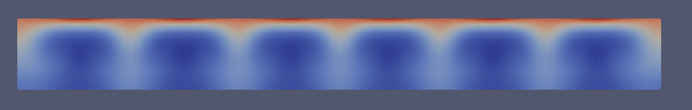

## Discussion:

https://www.cfd-online.com/Forums/openfoam-solving/80454-p_rgh-1-7-a.html

## Key points:

In the createFields the p_rgh is defined as:

p_rgh = p - rho\*gh;

So it is the pressure without the hydrostatic pressure and is intialized from the pressure field in the p-file.

In the pEqn.H file, the pressure equation is written and solved for the p_rgh, so the boundary conditions important for the pressure solution are the p_rgh conditions. After the pressure solution, the p is calculated with:

p = p_rgh + rho\*gh;

To understand the different pressures, look at Bernoulli:

Dynamic pressure --> 1/2*rho*v^2
Hydraulic pressure--> rho*g*h
Static pressure --> p

1/2*rho*v^2 + rho*g*h + p = Constant

From the openFoam site, p_rgh = p - rho*g*h.

So, p_rgh is the static pressure minus the hydraulic pressure, based on a arbitrary height.

## Sketch with g direction pointing to the negative axis

- p

- p_rgh

