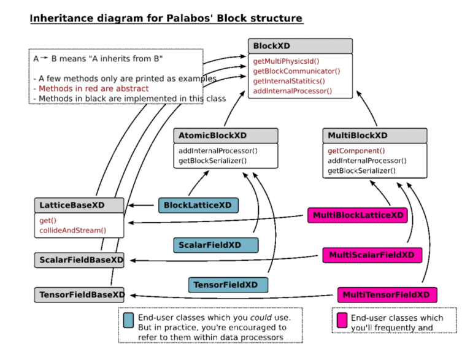
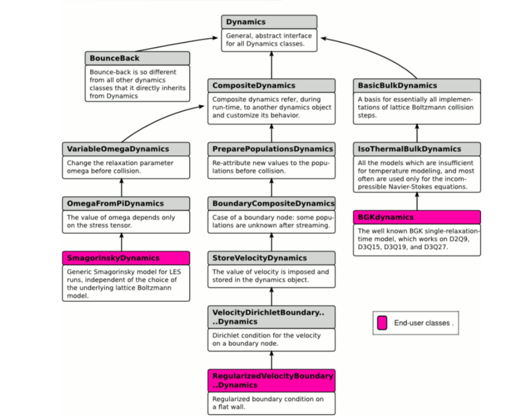
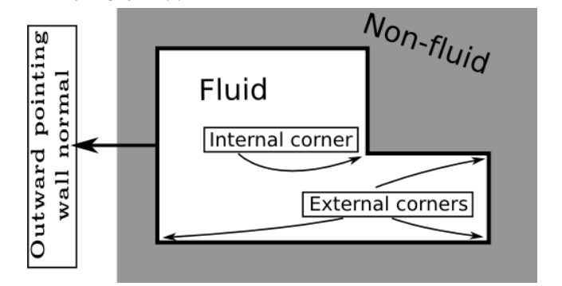

## Concepts

### Data Structure

- BlockLattice: store the particle population or other variables such as the external force
- ScalarFieldXD: store spatially extended scalar variable
- TensorFieldXD: store the vector- or tensor- fields
- AtomicBlockXD: regular data array
- MultiBlockXD: more complicated data array, which can be used to represent irregular domain, and automatically parallelize. It is recommended in the user-end applications
- BlockXD inheritance hierarchy:
  

### Lattice Descriptors

- specify a few topological properties of the lattice , including the number of particle populations, the discrete velocities, the weights of the directions, and other
  lattice constants

### Dynamics class

- streaming: hard code, only depend on the discrete velocities
- collide: customized, local operator, realized in a generic way
- attributing dynamics objects: when constructing a new block-lattice,a shared dynamics object is assigned to each cell. After this, we may need to redefine an independenc dynamics object for some/all cells
- inheritance diagram:

### Data Processors

- non-local operations
- usage1: exchange the information among several blocks, either of the same type or of the different types
- usage2: implement reduction operations
- developments: All you need to do is write a function which receives an
  atomic-block and the coordinates of a sub-domain as parameters, and executes an algorithm on this sub-domain. All
  complex operations, like the sub-division of the operations in presence of a multi-block, or the parallelization of the code, are automatic.
- executed after the collision-streaming cycles

### Boundary Conditions

- internal and external: depend on whether the corner is convex or concave
  
- wall/corner normal direction: point away from the fluid, into the non-fluid zone
- 2D orientation label:The extensions like 1P`, ``NP, and PP at the end of the methods of the boundary-condition object are used to indicate the orientation of the wall normal, pointing outside the fluid domain, as shown on the figure above. On a straight wall, the code 1P means: “the wall normal points into positive y-direction”. Likewise, the inlet would be labeled with the code 0N as in “negative x-direction”. On a corner, the code NP means “negative x-direction and positive y-direction”.
- 3D orientation label: use addVelocityBoundaryDO, where the direction D can be 0 for x, 1 for y, or 2 for z, and the orientation O has the value P for positive and N for
  negative. Edges can be internal or external. For example: addInternalVelocityEdge0NP, addExternalVelocityEdge1PN, where the first digit of the code indicates the axis to which the edge is parallel, and the two subsequent digits indicate the orientation of the edge inside the plane normal to the edge, in the same way as the corner nodes in 2D. The axes
  are counted periodically: 0NP means x-plane, negative y-value, and positive z-value, whereas 1PN means y-plane, positive z-value, and negative x-value. Finally, 3D corners are constructed in the same way as in 2D, through a function call like the following: addInternalVelocityCornerPNP, addExternalVelocityCornerNNN

## IO

- IOStream use the parallizable version: pcout, pcerr,pclog,plb_ofstream,plb_ifstream
- user input must be received either through an input file or directly from the command line
- recommend to use XML file to receive the user input (just small size) by using the built-in XML utilities
- imageWriter: produce image in the PPM format or GIF image
- vtk:enable postprocessing for paraview
- checkpointing: saving and loading state of a simulation

## Time Cycles

1. To start with, all fluid variables are defined at time t. The particle populations are in pre-collision state (also called “incoming populations”).
2. The collision operator is applied to all cells. They are now in post-collision state (also called “outgoing variables”).
3. The streaming operator is applied to the lattice.
4. All data processors are executed, to perform non-local operations or couplings between lattices.
5. The populations are now again in pre-collision state, but at time t+1

## Useful functions/classes

- defineDynamics: adjust the dynamics of a group of cells
- initializeAtEquilibrium: initialize the cells with the specified density and velocity within a domain at an equilibrium distribution
- OnLatticeBoundaryConditionXD: offer a uniform interface to implement the boundary condition by instantiating the dynamics objects for local B.C., or adding data processors for the non-local operations, or both.
- setBoundaryVelocity, setBoundaryDensity: set Dirichlet B.C.

### To Read

- pipelining data evaluation operators
- loadGeometry.cpp: it seems it can used to realize the porous flow
- checkpointing: saving and loading the state of a simulation
- useIOstream.cpp
- manualUserInput,coo
