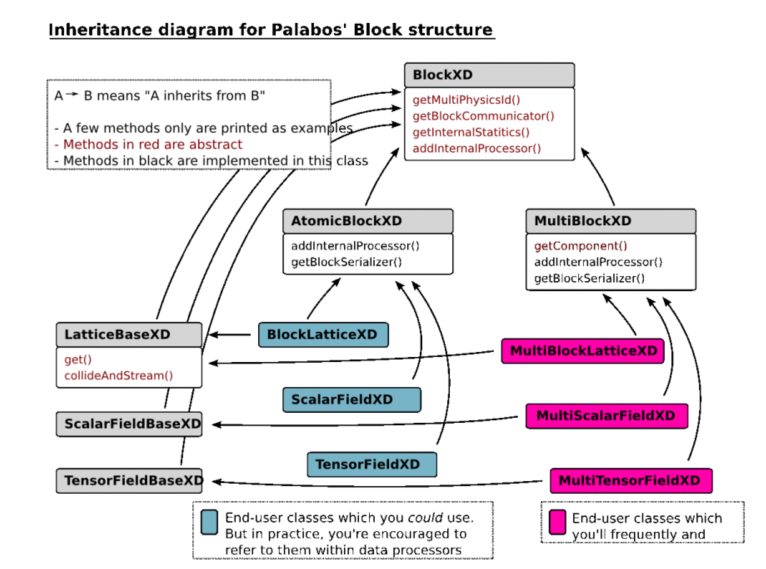
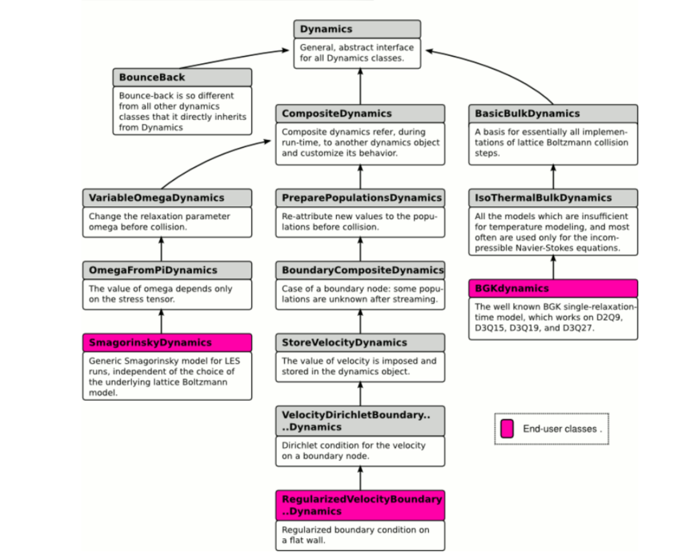

## Concepts

### Data Structure

- BlockLattice: store the particle population or other variables such as the external force
- ScalarFieldXD: store spatially extended scalar variable
- TensorFieldXD: store the vector- or tensor- fields
- AtomicBlockXD: regular data array
- MultiBlockXD: more complicated data array, which can be used to represent irregular domain, and automatically parallelize. It is recommended in the user-end applications
- BlockXD inheritance hierarchy:
  

### Lattice Descriptors

- specify a few topological properties of the lattice , including the number of particle populations, the discrete velocities, the weights of the directions, and other
  lattice constants

### Dynamics class

- streaming: hard code, only depend on the discrete velocities
- collide: customized, local operator, realized in a generic way
- attributing dynamics objects: when constructing a new block-lattice,a shared dynamics object is assigned to each cell. After this, we may need to redefine an independenc dynamics object for some/all cells
- inheritance diagram:

### Data Processors

- non-local operations
- usage1: exchange the information among several blocks, either of the same type or of the different types
- usage2: implement reduction operations
- developments: All you need to do is write a function which receives an
  atomic-block and the coordinates of a sub-domain as parameters, and executes an algorithm on this sub-domain. All
  complex operations, like the sub-division of the operations in presence of a multi-block, or the parallelization of the code, are automatic.
- executed after the collision-streaming cycles

## Time Cycles

1. To start with, all fluid variables are defined at time t. The particle populations are in pre-collision state (also called “incoming populations”).
2. The collision operator is applied to all cells. They are now in post-collision state (also called “outgoing variables”).
3. The streaming operator is applied to the lattice.
4. All data processors are executed, to perform non-local operations or couplings between lattices.
5. The populations are now again in pre-collision state, but at time t+1

### To Read

- loadGeometry.cpp: it seems it can used to realize the porous flow
- checkpointing: saving and loading the state of a simulation
