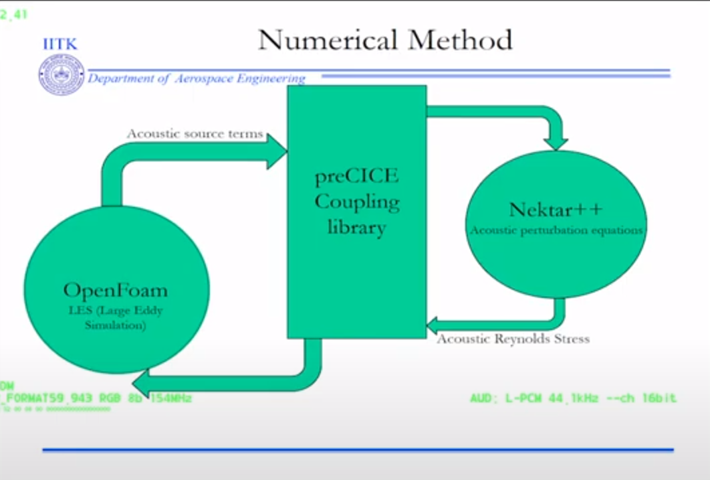
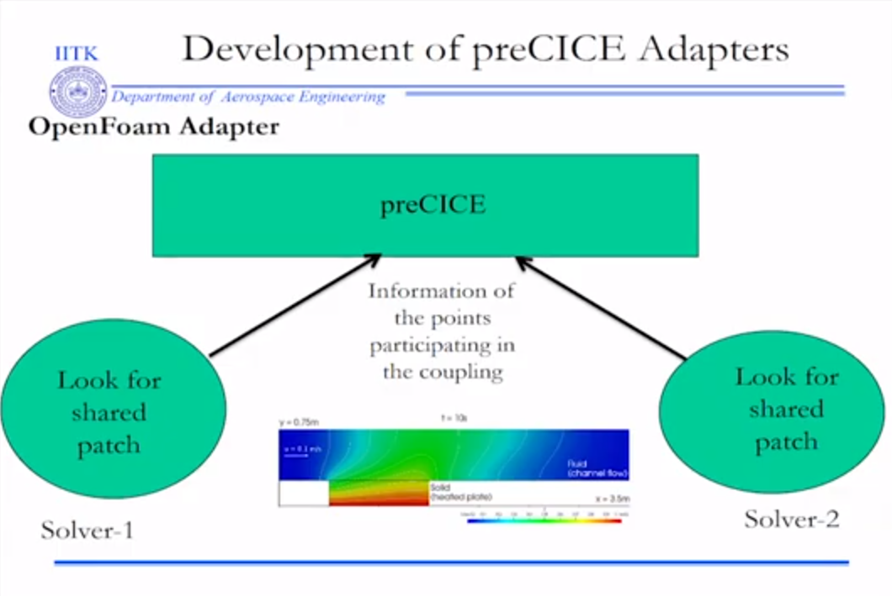
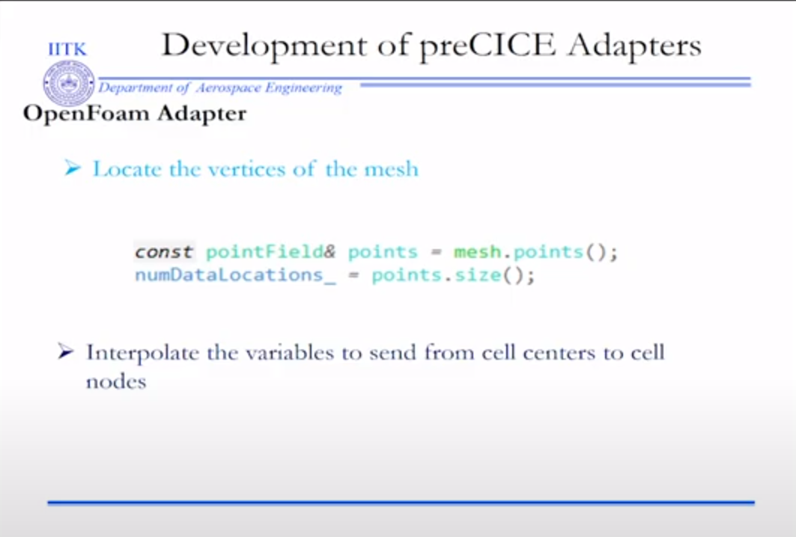
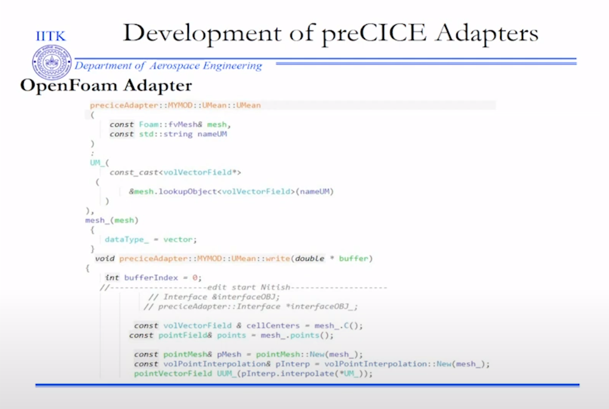
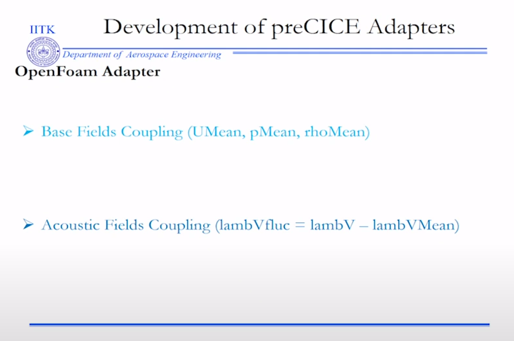
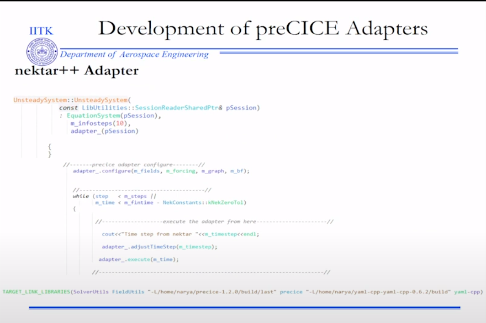
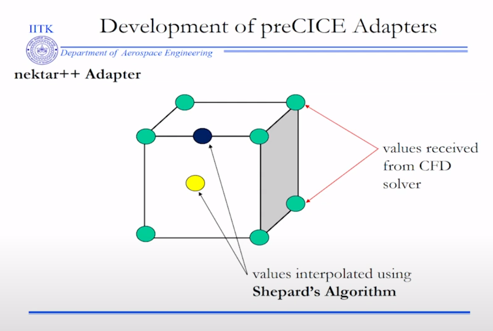
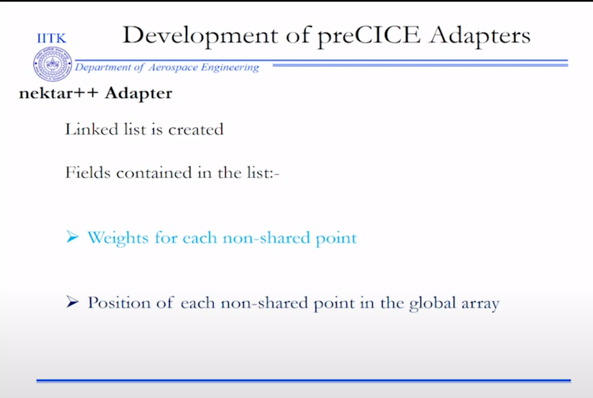
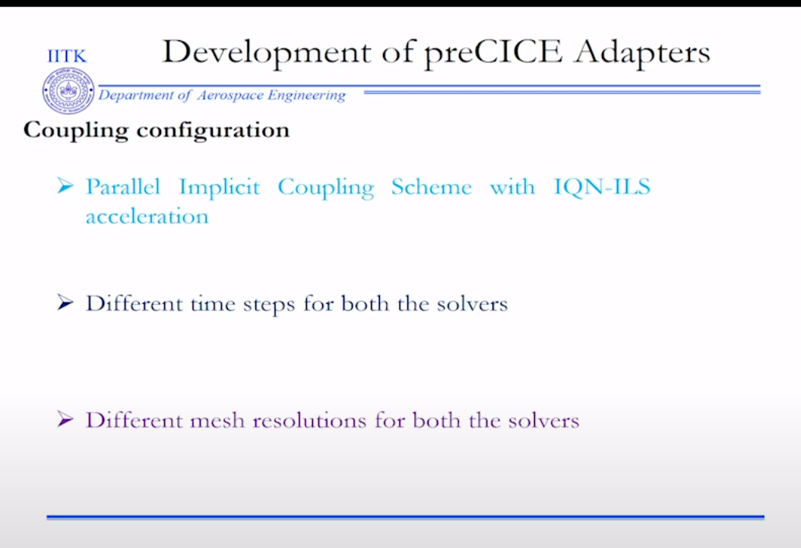
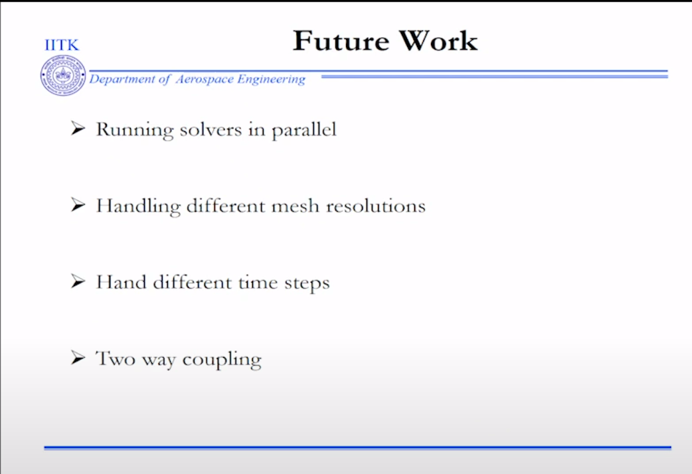

The present study uses preCICE to couple OpenFOAM and nektar++ for an aeroacoustic application. Initially, the mean velocity, density and pressure from a compressible solver in OpenFOAM are transferred to nektar++. These fields are then used as basefields over which the acoustic perturbations are calculated using APESolver in the nektar++ framework. The source terms from OpenFOAM are transferred at each time step. The computational domain in nektar++ is divided into two parts- the first part is the region where the acoustic equations are solved using the source terms from the flow solver and the second part corresponds to the free propagation region without any source terms. The source terms are exchanged within a volume where dominant acoustic sources are present. Large Eddy Simulation (LES) is employed for the flow solver while the acoustic solver uses Acoustic Perturbation Equations employing a Discontinuous Galerkin Method. The simulation is validated against the experimental results for flow over a cubic obstacle kept over a flat plate.

1. locate the vertices of the mesh of OpenFoam
2. interpolate the data from the cell centers (OpenFoam) to cell nodes (Acoustic solver)
3. communicate

customized interpolation in the Acoustic solver

